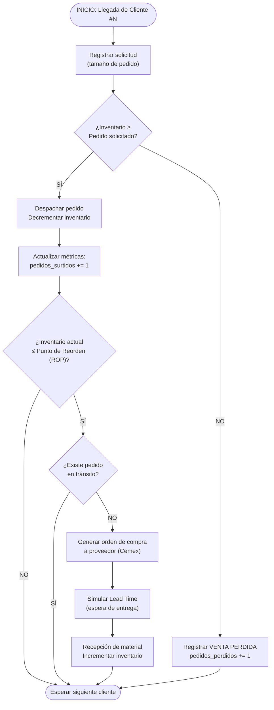

# Proyecto Integrador Académico (PIA) — Simulación de Sistemas

## Entregable 1: Fundamentos, Planificación y Modelo Base

**Materia:** Simulación  
**Fecha de entrega:** Abril 2026  
**Equipo:** *[Nombres de los integrantes]*

---

# PARTE 1: Semana 1 — Fundamentos y Planificación

---

## 1. Definición del Problema

Un centro de distribución de materiales de construcción operando bajo el modelo de franquicia Construrama enfrenta un reto operativo crítico: **mantener niveles óptimos de inventario de cemento frente a una demanda inherentemente variable e incierta**.

La problemática se articula en tres dimensiones simultáneas:

- **Demanda estocástica:** Los pedidos de clientes (albañiles, contratistas, constructoras, público general) no llegan en intervalos regulares ni con volúmenes uniformes. La demanda se ve afectada por estacionalidad (temporada de lluvias, ciclos de obra pública), condiciones económicas locales y decisiones individuales de compra.

- **Restricciones logísticas del proveedor:** El reabastecimiento desde la planta cementera (Cemex) no es instantáneo. Existe un *lead time* (tiempo de entrega) que introduce un retardo entre el momento en que se detecta la necesidad de reabastecer y el momento en que el material está físicamente disponible en bodega. Este *lead time* puede variar por disponibilidad de transporte, distancia a planta y carga operativa del proveedor.

- **Costos contrapuestos:** Mantener un inventario excesivamente alto genera costos de almacenamiento, capital inmovilizado y riesgo de deterioro del producto. Por el contrario, un inventario insuficiente provoca **desabasto** (*stockout*), que se traduce en ventas perdidas, clientes insatisfechos y daño reputacional.

El problema central consiste en **determinar políticas de inventario** —específicamente el punto de reorden (*Reorder Point*, ROP) y la cantidad de pedido (*Order Quantity*, Q)— que equilibren estos factores en un entorno de incertidumbre.

---

## 2. Justificación

### 2.1 Relevancia del sistema logístico

La industria de materiales de construcción en México representa un sector estratégico de la economía. Los centros Construrama constituyen una red de distribución capilar que acerca el producto al consumidor final. La eficiencia logística de cada punto de venta impacta directamente en:

- **Competitividad regional:** Un distribuidor con buen nivel de servicio retiene clientela frente a competidores informales.
- **Flujo de caja:** El inventario es capital invertido. Optimizar su rotación libera recursos para reinversión.
- **Satisfacción del cliente:** En el sector construcción, un desabasto puede paralizar obras completas, generando costos en cascada para el cliente.

### 2.2 Valor de la simulación como herramienta de análisis

A diferencia de los modelos analíticos clásicos (EOQ, modelo de Wilson), que asumen parámetros estáticos y distribuciones idealizadas, la **simulación computacional** permite:

1. **Modelar la variabilidad real** de la demanda y los tiempos de entrega sin necesidad de simplificaciones excesivas.
2. **Experimentar sin riesgo:** Se pueden probar decenas de políticas de inventario en minutos, sin alterar la operación real del negocio.
3. **Capturar interacciones dinámicas** entre procesos concurrentes: mientras un pedido está en tránsito, la demanda continúa consumiendo el stock restante.
4. **Generar métricas estadísticas robustas** (intervalos de confianza, análisis de varianza) que soporten la toma de decisiones con evidencia cuantitativa.

La simulación transforma un problema complejo y multidimensional en un laboratorio controlado donde se pueden aislar variables y medir su impacto.

---

## 3. Objetivos del Modelo

### 3.1 Objetivo general

Desarrollar un modelo de simulación de eventos discretos que represente fielmente la operación de inventario de un centro de distribución Construrama, y que permita evaluar políticas de reabastecimiento para optimizar el nivel de servicio y minimizar costos operativos.

### 3.2 Objetivos específicos

1. **Identificar el punto de reorden (ROP) óptimo** que minimice la probabilidad de desabasto sin incurrir en sobre-inventario.
2. **Determinar la cantidad de pedido (Q)** más eficiente considerando los costos de ordenar y almacenar.
3. **Cuantificar el nivel de servicio** del sistema bajo distintas configuraciones de parámetros.
4. **Medir la tasa de ventas perdidas** y su impacto económico estimado.
5. **Establecer una base de código extensible** que permita incorporar distribuciones estadísticas y análisis de sensibilidad en fases posteriores del PIA.

---

## 4. Identificación de Variables

### 4.1 Variables de entrada

| Variable | Descripción | Unidad | Valor inicial (determinista) |
|---|---|---|---|
| `TIEMPO_ENTRE_LLEGADAS` | Intervalo entre la llegada de un cliente y el siguiente | Días | 1.0 |
| `TAMANO_PEDIDO` | Cantidad de producto que solicita cada cliente | Unidades (bultos) | 25 |

> **Nota:** En fases posteriores, estas variables se modelarán con distribuciones probabilísticas (Exponencial para tiempos entre llegadas, Poisson o Normal para tamaño de pedido).

### 4.2 Parámetros del sistema

| Parámetro | Descripción | Unidad | Valor |
|---|---|---|---|
| `CAPACIDAD_BODEGA` | Volumen máximo de almacenamiento físico | Unidades | 500 |
| `STOCK_INICIAL` | Inventario disponible al inicio de la simulación | Unidades | 200 |
| `PUNTO_REORDEN` (ROP) | Nivel de inventario que dispara una orden de compra | Unidades | 50 |
| `CANTIDAD_REABASTECIMIENTO` (Q) | Volumen estándar de compra al proveedor | Unidades | 150 |
| `LEAD_TIME_PROVEEDOR` | Tiempo que tarda Cemex en entregar un pedido | Días | 3.0 |
| `TIEMPO_SIMULACION` | Horizonte temporal de la corrida | Días | 30 |

### 4.3 Variables de estado

| Variable | Descripción |
|---|---|
| `nivel_inventario` | Cantidad actual de producto disponible en bodega en un instante dado |
| `pedido_en_transito` | Bandera booleana que indica si ya se emitió una orden al proveedor que aún no ha llegado |

### 4.4 Métricas de desempeño (Variables de salida)

| Métrica | Descripción | Unidad |
|---|---|---|
| Pedidos surtidos | Total de solicitudes de cliente atendidas exitosamente | Conteo |
| Ventas perdidas | Solicitudes rechazadas por falta de stock | Conteo |
| Nivel de servicio | `pedidos_surtidos / total_solicitudes × 100` | Porcentaje |
| Unidades vendidas | Volumen total de producto despachado | Unidades |
| Órdenes al proveedor | Número de veces que se activó el reabastecimiento | Conteo |
| Inventario final | Stock remanente al cierre de la simulación | Unidades |

### 4.5 Supuestos del modelo

1. Se modela un **único producto** (cemento) por simplicidad. La extensión a múltiples SKUs es posible en fases posteriores.
2. El proveedor **siempre puede surtir** la cantidad solicitada (no hay restricción de capacidad en planta).
3. No se consideran **devoluciones** ni producto dañado.
4. La demanda no atendida se registra como **venta perdida** (no se genera *backorder*; el cliente se retira).
5. La bodega opera en un **horario continuo** (simplificación: 24/7).
6. Se maneja una política de **revisión continua** del inventario: la verificación del ROP ocurre inmediatamente después de cada despacho.

---

## 5. Tipo de Simulación

### 5.1 Justificación del uso de Simulación de Eventos Discretos (SED)

El sistema de inventario del centro de distribución es un candidato natural para la **Simulación de Eventos Discretos** (SED) por las siguientes razones:

- **Eventos puntuales en el tiempo:** Los cambios de estado del sistema ocurren en momentos específicos y discretos (llegada de un cliente, despacho de material, llegada de un camión de reabastecimiento), no de forma continua.

- **Naturaleza estocástica de las entradas:** La demanda y los tiempos de entrega son inherentemente aleatorios. La SED permite incorporar distribuciones de probabilidad que capturen esta variabilidad de forma natural a través de generadores de números pseudoaleatorios.

- **Interacción entre procesos concurrentes:** Mientras el sistema atiende clientes en mostrador, un pedido al proveedor puede estar en tránsito. La SED modela esta concurrencia sin recurrir a ecuaciones diferenciales.

- **Avance eficiente del tiempo:** A diferencia de la simulación continua que evalúa el estado en cada incremento Δt, la SED salta directamente al siguiente evento relevante, lo que la hace computacionalmente más eficiente para este tipo de sistemas.

### 5.2 Herramienta seleccionada: SimPy

**SimPy** es una librería de Python basada en procesos (*process-based*) que permite modelar SED mediante generadores de Python (`yield`). Fue seleccionada por:

- Paradigma de procesos intuitivo que mapea directamente a la lógica del negocio.
- Recursos integrados (`Container`, `Resource`, `Store`) ideales para modelar inventarios.
- Amplia documentación y comunidad académica activa.
- Integración nativa con el ecosistema científico de Python (NumPy, SciPy, Matplotlib).

---

## 6. Cronograma y Roles

### 6.1 Asignación de roles

| Rol | Responsabilidad principal |
|---|---|
| **Project Manager (PM)** | Coordinación general, seguimiento de entregables, gestión de tiempos y comunicación con el docente. |
| **Analista Estadístico (AE)** | Selección de distribuciones, ajuste de datos, análisis de resultados, pruebas de hipótesis y ANOVA. |
| **Desarrollador Python (DP)** | Implementación del código de simulación, pruebas unitarias, optimización y visualización de resultados. |

### 6.2 Cronograma del PIA (5 semanas)

| Semana | Actividad | Responsable(s) | Entregable |
|---|---|---|---|
| **1** | Definición del problema, justificación, objetivos, identificación de variables, tipo de simulación, cronograma. | PM + AE | Documento de planificación (Parte 1) |
| **2** | Modelo conceptual, estructura del sistema, código base determinista en SimPy, justificación del enfoque. | DP + AE | Código base funcional + diagrama de flujo (Parte 2) |
| **3** | Incorporación de distribuciones probabilísticas (Exponencial, Poisson), calibración de parámetros con datos empíricos o de referencia. | AE + DP | Modelo estocástico funcional |
| **4** | Diseño de experimentos, múltiples corridas, recolección de datos de salida, análisis estadístico (intervalos de confianza, ANOVA). | AE + PM | Informe de análisis estadístico |
| **5** | Optimización de políticas (ROP, Q), visualización de resultados (gráficas), documentación final, presentación. | PM + DP + AE | Informe final integrado + presentación |

---

## 7. Firma de Integridad Académica

> **Declaración de Originalidad**
>
> Los abajo firmantes declaramos que el presente trabajo es resultado de nuestro esfuerzo intelectual colaborativo. Todo contenido, código fuente, análisis y documentación han sido desarrollados de manera original por los integrantes del equipo. Cualquier fuente externa consultada —incluyendo libros de texto, artículos académicos, documentación técnica de software o recursos en línea— se encuentra debidamente referenciada conforme a estándares académicos.
>
> Nos comprometemos a no incurrir en plagio, fabricación de datos ni cualquier otra forma de deshonestidad académica. Asimismo, reconocemos que la utilización de herramientas de inteligencia artificial generativa ha sido empleada exclusivamente como apoyo para la estructuración del código y la documentación, siendo todo el análisis, las decisiones de diseño y la interpretación de resultados responsabilidad directa de los integrantes del equipo.
>
> **Integrantes:**  
> *[Nombre completo del integrante 1] — [Matrícula]*  
> *[Nombre completo del integrante 2] — [Matrícula]*  
> *[Nombre completo del integrante 3] — [Matrícula]*  
>
> **Fecha:** Abril 2026

---

# PARTE 2: Semana 2 — Modelo Base y Programación

---

## 8. Desarrollo del Modelo Conceptual

### 8.1 Descripción narrativa del flujo

El sistema opera bajo un ciclo continuo de atención a la demanda:

1. **Generación de demanda:** Los clientes llegan al centro de distribución en intervalos de tiempo determinados. Cada cliente solicita una cantidad específica de producto.

2. **Verificación de disponibilidad:** Al momento de la solicitud, el sistema consulta el nivel actual de inventario en bodega.

3. **Despacho o rechazo:**
   - Si el inventario disponible es **mayor o igual** a la cantidad solicitada, se despacha el pedido y se decrementa el inventario.
   - Si el inventario es **insuficiente**, se registra como una **venta perdida** y el cliente se retira sin producto.

4. **Evaluación de la política de reorden:** Después de cada despacho exitoso, el sistema evalúa si el nivel de inventario ha caído por debajo del **punto de reorden (ROP)**. Si es así, y no existe ya un pedido en tránsito, se genera una **orden de compra** al proveedor.

5. **Reabastecimiento:** La orden de compra activa un proceso paralelo que simula el *lead time* del proveedor. Una vez transcurrido este tiempo, el inventario se incrementa con la cantidad recibida.

### 8.2 Diagrama de flujo del proceso



---

## 9. Estructura del Sistema

### 9.1 Eventos del sistema

| Evento | Descripción | Efecto sobre el estado |
|---|---|---|
| **Llegada de cliente** | Un cliente se presenta en el centro solicitando producto | Dispara la verificación de inventario |
| **Despacho de pedido** | Se entrega el producto al cliente | Decrementa `nivel_inventario` |
| **Generación de orden de compra** | El inventario cae bajo el ROP y no hay pedido en tránsito | Activa `pedido_en_transito = True` |
| **Recepción de reabastecimiento** | El proveedor entrega el material tras el *lead time* | Incrementa `nivel_inventario`, desactiva `pedido_en_transito` |
| **Venta perdida** | No hay stock suficiente para atender la demanda | Incrementa `pedidos_perdidos` |

### 9.2 Estados del sistema

El estado completo del sistema en cualquier instante *t* queda descrito por la tupla:

```
Estado(t) = ( nivel_inventario(t), pedido_en_transito(t) )
```

Donde:
- `nivel_inventario(t)` ∈ [0, CAPACIDAD_BODEGA] — entero no negativo
- `pedido_en_transito(t)` ∈ {Verdadero, Falso} — booleano

### 9.3 Procesos identificados

1. **Proceso generador de demanda** (`proceso_clientes`): Bucle infinito que genera llegadas de clientes a intervalos regulares (fase determinista) o aleatorios (fase estocástica futura).

2. **Proceso de reabastecimiento** (`proceso_reabastecimiento`): Proceso activado condicionalmente que simula la latencia del proveedor y ejecuta la reposición de inventario.

---

## 10. Implementación Inicial en Python

El código fuente completo se encuentra en el archivo adjunto **`Sem1.2.0.py`**.

A continuación se describen los componentes principales:

- **Constantes de configuración:** Parámetros centralizados al inicio del archivo para facilitar la experimentación.
- **Clase `CentroDistribucion`:** Encapsula el estado del sistema (inventario, métricas, banderas de control) y el proceso de reabastecimiento.
- **Función generadora `proceso_clientes`:** Simula el flujo continuo de clientes usando `yield` de SimPy.
- **Función `ejecutar_simulacion`:** Orquesta la inicialización del entorno, la ejecución y la recolección de resultados.
- **Función `imprimir_reporte`:** Presenta un resumen ejecutivo al finalizar la simulación.

> **Referencia al código:** Véase el archivo `Sem1.2.0.py` para la implementación completa con comentarios técnicos exhaustivos.

---

## 11. Justificación del Enfoque Técnico

### 11.1 ¿Por qué Python?

Python fue seleccionado como lenguaje de implementación por las siguientes razones:

1. **Ecosistema científico maduro:** Acceso a librerías como NumPy, SciPy y Matplotlib que serán esenciales en las fases de análisis estadístico y visualización.
2. **Legibilidad y mantenibilidad:** La sintaxis clara de Python facilita la documentación y revisión del modelo, criterios relevantes en un contexto académico.
3. **Paradigma de generadores:** Los generadores nativos de Python (`yield`) permiten modelar procesos concurrentes de forma elegante, sin necesidad de hilos (*threads*) ni *callbacks*.
4. **Portabilidad:** El código se ejecuta en cualquier sistema operativo sin modificaciones.

### 11.2 ¿Por qué SimPy?

| Criterio | SimPy | Arena/FlexSim | MATLAB Simulink |
|---|---|---|---|
| Costo de licencia | Gratuito (MIT) | Licencia comercial | Licencia comercial |
| Flexibilidad | Total (código abierto) | Limitada a GUI | Media |
| Curva de aprendizaje | Media | Alta | Alta |
| Integración estadística | Nativa (Python) | Limitada | Buena |
| Reproducibilidad | Total (scripts) | Parcial (archivos binarios) | Total |
| Adecuación académica | ★★★★★ | ★★★☆☆ | ★★★★☆ |

SimPy sigue un paradigma *process-based* que mapea de forma directa y natural la lógica del negocio:
- Un **cliente** es un proceso que llega, solicita, y se retira.
- El **inventario** es un `Container` de SimPy con nivel, capacidad y operaciones `get`/`put`.
- El **reabastecimiento** es un proceso paralelo activado por eventos del sistema.

Esta correspondencia uno-a-uno entre el modelo conceptual y el código reduce el riesgo de errores de traducción y facilita la validación del modelo.

---

## Referencias

1. Law, A. M. (2015). *Simulation Modeling and Analysis* (5th ed.). McGraw-Hill Education.
2. Banks, J., Carson, J. S., Nelson, B. L., & Nicol, D. M. (2014). *Discrete-Event System Simulation* (5th ed.). Pearson.
3. SimPy Documentation. (2024). *SimPy — Discrete event simulation for Python*. Recuperado de https://simpy.readthedocs.io/
4. Cemex. (2024). *Red de distribución Construrama*. Recuperado de https://www.cemex.com/
5. Silver, E. A., Pyke, D. F., & Thomas, D. J. (2017). *Inventory and Production Management in Supply Chains* (4th ed.). CRC Press.

---

*Documento generado como parte del Entregable 1 del PIA — Simulación de Sistemas, Abril 2026.*
